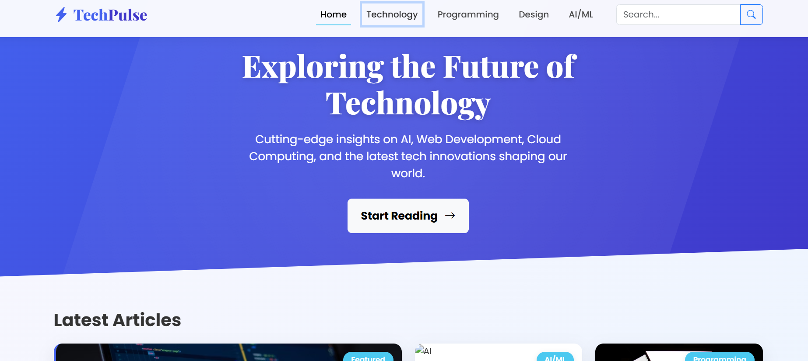

# Modern Blog Template with Bootstrap 5


A professional, responsive blog template built with Bootstrap 5 featuring modern animations, clean design, and fully responsive layout. Perfect for tech blogs, personal portfolios, or content websites.

## Features

- 🚀 **Fully Responsive Design** - Works flawlessly on mobile, tablet, and desktop
- ✨ **Modern Animations** - Smooth hover effects, entrance animations, and interactive elements
- 🎨 **Professional UI** - Clean design with thoughtful typography and color scheme
- 📱 **Mobile-First Approach** - Optimized for all screen sizes
- ⚡ **Performance Optimized** - Lightweight with only essential dependencies
- 🔧 **Easy Customization** - Well-structured code for simple modifications
- 🌓 **Dark Mode Support** - Stylish dark theme for the footer section

## Technologies Used

- **Bootstrap 5** - Frontend framework for responsive design
- **Bootstrap Icons** - Icon library for UI elements
- **Google Fonts** - Typography (Poppins and Playfair Display)
- **CSS3** - Custom styling and animations
- **JavaScript** - Interactive elements and scroll effects

## Live Demo

[View Live Demo](https://task8ofpraveen.netlify.app/)

## Getting Started

1. **Clone the repository**:
   ```bash